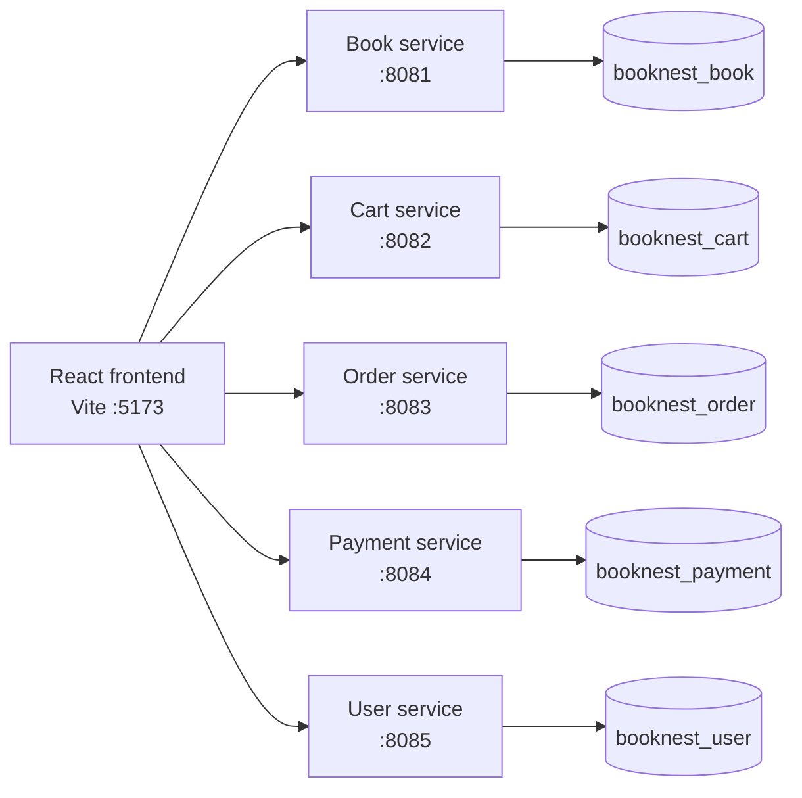

# BookNest

BookNest is a full-stack e-bookshop application built with React, Tailwind CSS, shadcn/ui, Spring Boot, and MySQL. The backend is split into five independent services, each with its own database.

The project currently supports:

- Book catalog browsing and book details
- Search and category filtering
- Customer registration and login
- Persistent shopping carts
- Checkout and mock card payments
- Stock reservation and release during checkout
- Order history and customer profile editing
- Admin book management, users, orders, and payment views
- Light and dark themes

> This is an academic/demo application. Authentication is currently implemented with the user service and frontend role checks; production-grade JWT/session security, password hashing, and a real payment gateway are not included.

## Architecture



### Services

| Service | Port | Database | Responsibility |
| --- | ---: | --- | --- |
| `book-service` | `8081` | `booknest_book` | Books, categories, prices, stock, and stock reservations |
| `cart-service` | `8082` | `booknest_cart` | Customer cart items |
| `order-service` | `8083` | `booknest_order` | Orders and order items |
| `payment-service` | `8084` | `booknest_payment` | Mock payment records |
| `user-service` | `8085` | `booknest_user` | Registration, login, profiles, and roles |

The frontend runs on Vite's default port, `5173`.

## Prerequisites

Install the following before starting the project:

- Java 17 or newer
- Apache Maven 3.9 or newer
- Node.js 20 or newer and npm
- MySQL 5.7+; MySQL 8 is recommended
- Git, if cloning the repository

The current Spring configuration expects MySQL on port `3308`. If your MySQL server uses the usual port `3306`, update the datasource URLs in each service's `src/main/resources/application.properties`.

## Project structure

```text
BookNest/
├── book-service/        # Catalog and inventory API
├── cart-service/        # Cart API
├── order-service/       # Order API
├── payment-service/     # Mock payment API
├── user-service/        # User and authentication API
├── frontend-v2/         # React + Vite frontend
├── db_setup.sql         # Database creation and seed data
├── README.md            # Setup and development guide
└── README_API.md        # Detailed REST API reference
```

## Database setup

### 1. Start MySQL

Start MySQL and make sure it is listening on port `3308`. Confirm the connection details in these five files:

```text
book-service/src/main/resources/application.properties
cart-service/src/main/resources/application.properties
order-service/src/main/resources/application.properties
payment-service/src/main/resources/application.properties
user-service/src/main/resources/application.properties
```

Each file should point to its own database and use the correct local MySQL username/password. Do not commit real production credentials.

### 2. Create and seed the databases

From the repository root, run the SQL script using MySQL's command-line client:

```powershell
Get-Content .\db_setup.sql | mysql -u root -p -P 3308
```

Alternatively, open `db_setup.sql` in MySQL Workbench or DBeaver and execute it.

The script creates and seeds:

```text
booknest_user
booknest_book
booknest_cart
booknest_order
booknest_payment
```

The seed data includes these demo accounts:

| Email | Password | Role |
| --- | --- | --- |
| `admin@booknest.com` | `admin123` | `ADMIN` |
| `john@gmail.com` | `john123` | `CUSTOMER` |
| `jane@gmail.com` | `jane123` | `CUSTOMER` |

These credentials are for local development only.

## Backend setup and run

Each backend service is an independent Maven/Spring Boot application. Open one terminal for each service.

From the repository root, run:

```powershell
cd .\book-service
mvn spring-boot:run
```

Then repeat the same command in separate terminals for:

```text
cart-service
order-service
payment-service
user-service
```

The services should be available at:

```text
http://localhost:8081
http://localhost:8082
http://localhost:8083
http://localhost:8084
http://localhost:8085
```

If Maven Wrapper is available in your environment, `./mvnw spring-boot:run` can be used instead of `mvn spring-boot:run`.

## Frontend setup and run

Open another terminal:

```powershell
cd .\frontend-v2
npm install
Copy-Item .env.example .env
npm run dev
```

Open the URL printed by Vite, normally:

```text
http://localhost:5173
```

The frontend reads service URLs from `.env`:

```env
VITE_BOOK_API_URL=http://localhost:8081
VITE_CART_API_URL=http://localhost:8082
VITE_ORDER_API_URL=http://localhost:8083
VITE_PAYMENT_API_URL=http://localhost:8084
VITE_USER_API_URL=http://localhost:8085
```

The frontend has the same localhost defaults in code, but keeping a `.env` file makes local or deployed service URLs explicit.

## Checkout flow

Checkout is coordinated by the frontend across the backend services:

1. The frontend fetches the latest book catalog and prices.
2. It verifies that every cart item still exists and has sufficient stock.
3. It reserves stock atomically through `book-service`.
4. It creates a `PENDING` order through `order-service`.
5. It records a successful mock payment through `payment-service`.
6. It updates the order to `COMPLETED`.
7. It deletes the customer's cart items through `cart-service`.
8. It refreshes the catalog so the new stock is shown immediately.

If payment or order completion fails, the frontend attempts to delete the partial payment/order and releases any stock reservations already made. The payment screen displays the error instead of clearing the cart.

Stock endpoints:

```text
POST http://localhost:8081/api/books/{id}/reserve?quantity=2
POST http://localhost:8081/api/books/{id}/release?quantity=2
```

The payment implementation is simulated. No real card details are sent to an external provider.

## Testing and validation

### Frontend checks

```powershell
cd .\frontend-v2
npm run typecheck
npm run lint
```

To create a production frontend bundle:

```powershell
npm run build
```

### Backend tests

Run the test suite separately in each service:

```powershell
cd .\book-service; mvn test
cd ..\cart-service; mvn test
cd ..\order-service; mvn test
cd ..\payment-service; mvn test
cd ..\user-service; mvn test
```

The current backend tests verify that each Spring application context starts successfully and can connect to its configured database. A complete browser-based end-to-end checkout test still requires all five services and the frontend to be running together.

## API reference

See [README_API.md](README_API.md) for the full REST endpoint list and example payloads.

The main endpoint groups are:

```text
GET/POST/PUT/DELETE /api/books       book-service
GET/POST/PUT/DELETE /api/cart        cart-service
GET/POST/PUT/DELETE /api/orders      order-service
GET/POST/DELETE     /api/payments    payment-service
GET/POST/PUT/DELETE /api/users       user-service
```

Useful smoke tests after starting the services:

```powershell
Invoke-RestMethod http://localhost:8081/api/books
Invoke-RestMethod http://localhost:8082/api/cart?userId=2
Invoke-RestMethod http://localhost:8083/api/orders?userId=3
Invoke-RestMethod http://localhost:8085/api/users
```

## Troubleshooting

### A service cannot connect to MySQL

Check that:

1. MySQL is running.
2. MySQL is listening on port `3308`.
3. The corresponding `booknest_*` database exists.
4. The username and password in that service's `application.properties` are correct.
5. `db_setup.sql` has been executed.

### The frontend shows API errors

Make sure all required backend services are running and that the URLs in `frontend-v2/.env` match their ports. Restart Vite after changing `.env` values.

### A port is already in use

Stop the process using the port or change the corresponding `server.port` value and frontend `VITE_*_API_URL` value together.

### Admin features are unavailable

Sign in with the seeded admin account. The current admin restriction is a frontend role check and is not a substitute for backend authorization in production.

## Development notes

- Do not share database tables between services. Each service owns its own schema.
- Keep API changes reflected in both the backend controller and `frontend-v2/src/lib/api.ts`.
- Use the stock reservation endpoints during any new purchase flow so inventory cannot be oversold by stale catalog data.
- Keep payment handling mock-only until a real payment provider and secure server-side integration are added.
- Avoid committing `.env` files or real credentials.
