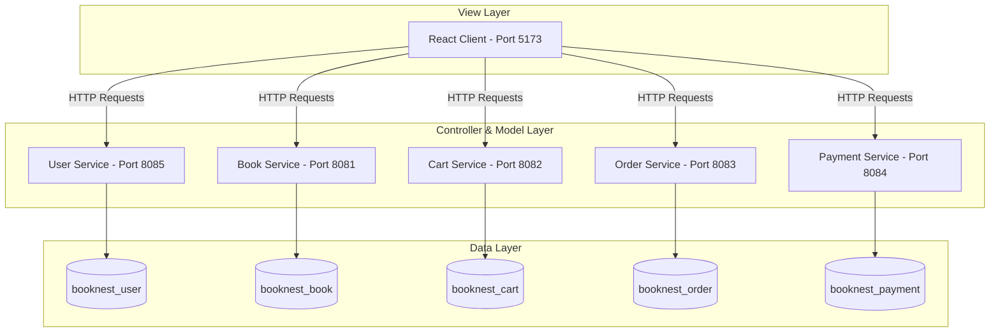
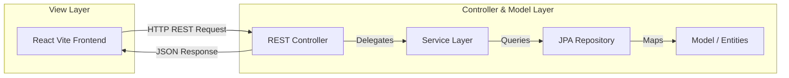
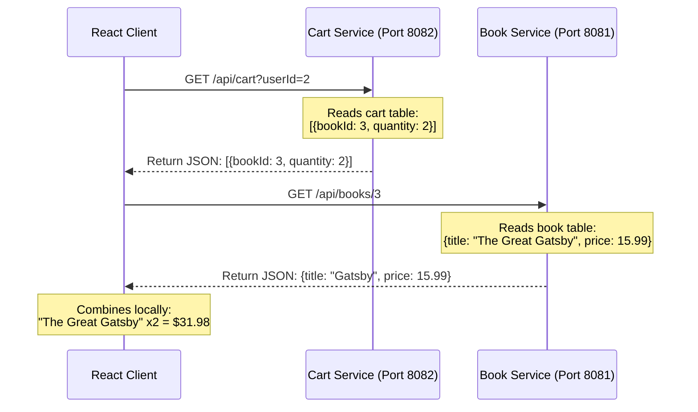
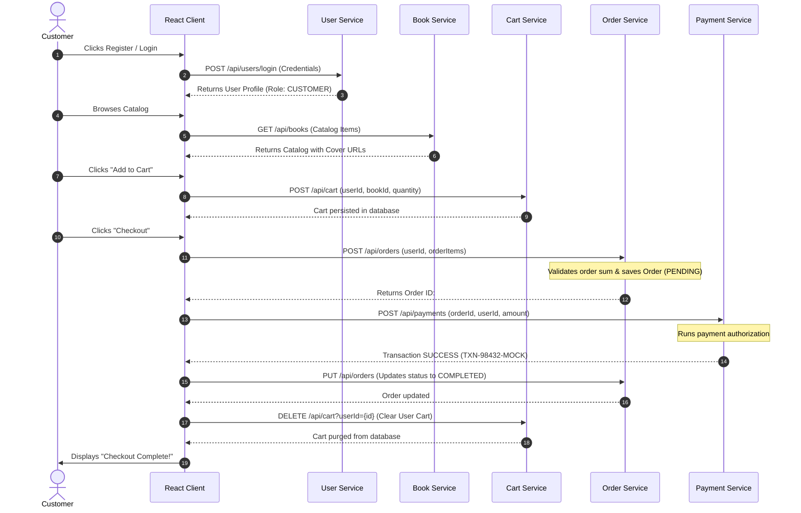

# BookNest Microservices Architecture & REST API Guide

This guide explains how BookNest's decoupled microservices function together, describes the user-to-service communication flows, and lists all available REST endpoints.

---

## 1. Architectural Overview & Work Flow

BookNest is built using a **5-microservices architecture** designed for high scalability, separation of concerns, and fault isolation. Each microservice governs a distinct business domain, runs on its own isolated server port, and maintains its own dedicated database.



---

## 2. REST & MVC Architecture in BookNest

BookNest leverages the **Model-View-Controller (MVC)** design pattern, implemented across decoupled Spring Boot microservices (acting as Model and Controller) and a React client (acting as the View).



### 2.1. Model-View-Controller (MVC) Pattern Breakdown

1. **Model (Data Representation & Entities)**:
   * Mapped directly to MySQL database schemas using Java Persistence API (JPA) annotations (such as `@Entity`, `@Table`, `@Id`, `@Column`).
   * *Example*: In `book-service`, the `Book` class (`com.example.book_service.data.Book`) defines the shape of our catalog items (including title, author, price, coverUrl, description).
   * *Example*: Spring Data JPA repositories (like `BookRepository` interface extending `JpaRepository`) handle entity querying and database updates behind the scenes.

2. **View (Presentation Layer)**:
   * Since this is a decoupled, headless API setup, the **Spring Boot backends do not render HTML views directly**.
   * Instead, they serialize Model structures into standardized **JSON payloads** and transmit them via HTTP.
   * The **View** is decoupled and implemented entirely on the client-side via **React (`frontend-v2`)**. The frontend fetches the JSON models from backend ports and dynamically renders the interfaces (e.g. Catalog grid, Checkout dialogs, Profile forms) in the browser.

3. **Controller (Endpoints Handler)**:
   * Spring controllers annotated with `@RestController` (like `BookController`, `UserController`) act as the entry gateways.
   * They listen for incoming HTTP request verbs, parse request bodies or parameter queries (using `@RequestBody`, `@RequestParam`, `@PathVariable`), delegate processing to Service layers (e.g. `BookService`), and return Java objects which Spring automatically serializes to JSON views.

---

### 2.2. RESTful Principles in BookNest

BookNest adheres strictly to the core guidelines of **REpresentational State Transfer (REST)**:

1. **Client-Server Separation**: The client (React) and the servers (Spring Boot microservices) are completely decoupled. They can be refactored or redeployed independently, communicating solely via HTTP.
2. **Statelessness**: The servers do not maintain client session states. Each HTTP request contains all context needed (such as `userId` or transaction amounts) to resolve the transaction. User sessions are persisted locally on the client via `localStorage`.
3. **Uniform Interface**: Uses uniform resource naming schemas and standard HTTP verbs to execute actions:
   * `GET` (Safe, Idempotent): Used to retrieve data (e.g. `GET /api/books` lists all books; `GET /api/books/{id}` pulls one).
   * `POST` (Non-Idempotent): Used to create new resources (e.g. `POST /api/orders` places a checkout invoice).
   * `PUT` (Idempotent): Used to update resources (e.g. `PUT /api/users` modifies user profiles).
   * `DELETE` (Idempotent): Used to remove resources (e.g. `DELETE /api/cart/{id}` clears cart selections).
4. **Decoupled Service Addressing**: Each microservice addresses a specific resource endpoint collection on its own isolated server port (e.g. port `8081` for Books, port `8085` for Users, etc.).

---

## 3. Database Connection Mechanics

Each microservice is built with **Spring Boot Starter Data JPA** and connects to MySQL via the `com.mysql.cj.jdbc.Driver` driver.

### 3.1. Connection Configuration (`application.properties`)
Every microservice contains an isolated config sheet in `src/main/resources/application.properties` pointing to its respective schema:
```properties
# Example from book-service application.properties
spring.datasource.url=jdbc:mysql://localhost:3306/booknest_book
spring.datasource.username=root
spring.datasource.password=1@Anjana
spring.datasource.driver-class-name=com.mysql.cj.jdbc.Driver

# Hibernate Configuration
spring.jpa.hibernate.ddl-auto=update
spring.jpa.show-sql=true
```

### 3.2. JPA & Hibernate Lifecycle Style
1. **Schema Management (`ddl-auto=update`)**: During service startup, Hibernate scans Java classes annotated with `@Entity`. If tables or columns do not exist in MySQL, Hibernate automatically runs SQL `ALTER` or `CREATE` queries to match the models.
2. **Connection Pooling**: Spring Boot automatically configures **HikariCP** as the default connection pool, maintaining active database sockets to optimize query execution latency.

---

## 4. Cross-Service Data Retrieval Style ("Data Getting Style")

In a microservices environment, database tables cannot be combined using SQL `JOIN` statements because the databases are running in isolated contexts (often on separate physical machines). BookNest resolves this using **ID-based Referencing** combined with **Client-Side Aggregation**.



### 4.1. ID-Based Reference Decoupling
* Services do not contain foreign key constraints referencing tables in other services.
* For example, the `order_items` table in the `booknest_order` database contains a raw integer column `book_id` but has no database relationship linking it to the `books` table in `booknest_book`.

### 4.2. Client-Side Aggregation
* When the client needs to display the user's cart (with book cover, title, and current price), it first fetches the user's cart lines from `cart-service` (which only returns `bookId` and `quantity`).
* The client then maps those IDs to the book details fetched from the `books` array retrieved from `book-service`.
* This ensures that services remain completely decoupled and can be scaled, modified, or shut down independently.

---

## 5. End-to-End Checkout Workflow

When a user registers, shops, and completes a purchase, data flows across all 5 services sequentially as coordinated by the client:



---

## 6. Microservice Workflows & Endpoints Reference

### 6.1. Book Service (`book-service` on Port `8081`)
* **Workflow**: Serves as the read-only catalog repository for customers, and the write-only inventory console for administrators.
* **Database Tables**: `books` (id, title, author, price, stock, cover_url, description, category_id), `categories` (id, name).
* **JPA Model (`Book`)**:
  ```json
  {
    "id": 1,
    "title": "The Great Gatsby",
    "author": "F. Scott Fitzgerald",
    "isbn": "9780743273565",
    "price": 15.99,
    "stock": 100,
    "coverUrl": "https://...",
    "description": "A classic novel...",
    "category": { "id": 1, "name": "Fiction" }
  }
  ```
* **Endpoints**:
  * `GET /api/books` - Retrieve the entire book catalog.
  * `GET /api/books/{id}` - Retrieve a specific book by ID.
  * `GET /api/books?name={name}` - Search for books containing `name` in the title.
  * `POST /api/books` - Add a new book (requires admin privilege payload).
  * `PUT /api/books` - Update existing book parameters.
  * `DELETE /api/books/{id}` - Delete a book from inventory.

---

### 6.2. User Service (`user-service` on Port `8085`)
* **Workflow**: Handles user account registration, login verification via encrypted or matched strings, and profile settings modification.
* **Database Tables**: `users` (id, name, email, password, role).
* **JPA Model (`User`)**:
  ```json
  {
    "id": 1,
    "name": "John Doe",
    "email": "john@gmail.com",
    "password": "hashed_or_raw_password",
    "role": "CUSTOMER"
  }
  ```
* **Endpoints**:
  * `GET /api/users` - Retrieve all registered users (returns a safe `UserSummary` list without passwords).
  * `GET /api/users/{id}` - Retrieve a user by ID.
  * `POST /api/users` - Register a new user.
  * `POST /api/users/login` - Authenticate user credentials.
  * `PUT /api/users` - Update profile details.
  * `PUT /api/users/{id}/profile` - Securely edit profile details (Name, Email only).
  * `PUT /api/users?email={email}&password={newPassword}` - Reset password.
  * `DELETE /api/users/{id}` - Delete a user account.

---

### 6.3. Cart Service (`cart-service` on Port `8082`)
* **Workflow**: Persists shopping cart lines dynamically during customer sessions to prevent cart loss upon tab refresh.
* **Database Tables**: `cart_items` (id, user_id, book_id, quantity).
* **JPA Model (`CartItem`)**:
  ```json
  {
    "id": 1,
    "userId": 2,
    "bookId": 3,
    "quantity": 2
  }
  ```
* **Endpoints**:
  * `GET /api/cart` - Get all cart items.
  * `GET /api/cart?userId={userId}` - Get cart items staged for a specific user.
  * `POST /api/cart` - Add an item to the cart (or increment quantity).
  * `PUT /api/cart` - Update quantities.
  * `DELETE /api/cart/{id}` - Remove a specific item from the cart.

---

### 6.4. Order Service (`order-service` on Port `8083`)
* **Workflow**: Orchestrates purchase records. On creation, it validates that total sums match the line calculations and initializes the order as PENDING. Once payment returns successful, the client triggers a state change to COMPLETED.
* **Database Tables**: `orders` (id, user_id, total_amount, order_date, status), `order_items` (id, order_id, book_id, quantity, price).
* **JPA Model (`Order`)**:
  ```json
  {
    "id": 1,
    "userId": 2,
    "totalAmount": 47.98,
    "orderDate": "2026-07-09T02:00:00Z",
    "status": "COMPLETED",
    "orderItems": [
      { "id": 1, "bookId": 3, "quantity": 2, "price": 23.99 }
    ]
  }
  ```
* **Endpoints**:
  * `GET /api/orders` - List all orders.
  * `GET /api/orders?userId={userId}` - Retrieve order history for a specific customer.
  * `POST /api/orders` - Create a new order.
  * `PUT /api/orders` - Update order details.
  * `DELETE /api/orders/{id}` - Cancel/delete an order.

---

### 6.5. Payment Service (`payment-service` on Port `8084`)
* **Workflow**: Acts as the transaction ledger, creating mock transaction keys (e.g. `TXN-...`) and auditing successful checkout transactions.
* **Database Tables**: `payments` (id, order_id, user_id, amount, payment_method, status, transaction_id, payment_date).
* **JPA Model (`Payment`)**:
  ```json
  {
    "id": 1,
    "orderId": 1,
    "userId": 2,
    "amount": 47.98,
    "paymentMethod": "Credit Card",
    "status": "SUCCESS",
    "transactionId": "TXN-84930198-MOCK",
    "paymentDate": "2026-07-09T02:01:00Z"
  }
  ```
* **Endpoints**:
  * `GET /api/payments` - Audit all transactions.
  * `GET /api/payments?userId={userId}` - Get transaction receipts for a user.
  * `POST /api/payments` - Record a payment confirmation.
  * `DELETE /api/payments/{id}` - Delete a payment record.
