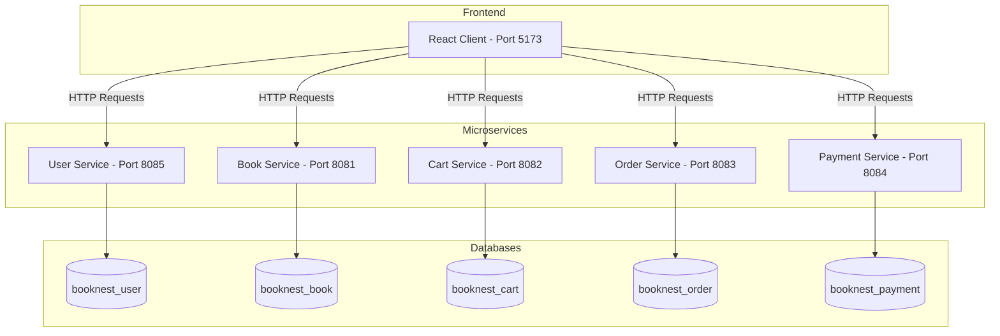

# BookNest Microservices Architecture & REST API Guide

This guide explains how BookNest's decoupled microservices function together, describes the user-to-service communication flows, and lists all available REST endpoints.

---

## 1. How the Microservices Architecture Works

BookNest is built using a **5-microservices architecture** designed for high scalability, separation of concerns, and fault isolation. Each microservice governs a distinct business domain, runs on its own isolated server port, and maintains its own dedicated database.



### Key Principles:
1. **Database Per Service**: Microservices do not share database tables. For example, `cart-service` cannot directly read the `books` table in `booknest_book`; instead, it references `book_id` records. The React client aggregates data from multiple endpoints.
2. **Stateless Communication**: The frontend acts as the orchestrator. When a customer checks out, the frontend coordinates actions across services sequentially:
   * **Step 1**: Submits order details (user ID, items, amounts) to `order-service`.
   * **Step 2**: Sends transaction data (order ID, amount, card info) to `payment-service`.
   * **Step 3**: Purges items in `cart-service` once the payment is approved.

---

## 2. Microservice Descriptions & Port Map

| Service Name | Port | Database Name | Description |
| :--- | :--- | :--- | :--- |
| **`book-service`** | `8081` | `booknest_book` | Stores the book catalog metadata, stock counts, category tags, and book covers. |
| **`cart-service`** | `8082` | `booknest_cart` | Persists user cart selections (books and quantities) for authenticated customers. |
| **`order-service`** | `8083` | `booknest_order` | Records orders placed, containing order statuses and lines item detail mappings. |
| **`payment-service`**| `8084` | `booknest_payment` | Audits transaction histories, simulated payment methods, and transaction keys. |
| **`user-service`** | `8085` | `booknest_user` | Manages user registry details, passwords, and authorization roles (`ADMIN`, `CUSTOMER`). |

---

## 3. Detailed REST Endpoints Reference

### 3.1. Book Service (`book-service` on Port `8081`)
Manages the inventory catalog.
* **JPA Model (`Book`)**:
  ```json
  {
    "id": 1,
    "title": "The Great Gatsby",
    "author": "F. Scott Fitzgerald",
    "isbn": "9780743273565",
    "price": 15.99,
    "stock": 100,
    "coverUrl": "https://...",
    "description": "A classic novel...",
    "category": { "id": 1, "name": "Fiction" }
  }
  ```

* **Endpoints**:
  * `GET /api/books` - Retrieve the entire book catalog.
  * `GET /api/books/{id}` - Retrieve a specific book by ID.
  * `GET /api/books?name={name}` - Search for books containing `name` in the title.
  * `POST /api/books` - Add a new book (requires admin privilege payload).
  * `PUT /api/books` - Update existing book parameters.
  * `DELETE /api/books/{id}` - Delete a book from inventory.

---

### 3.2. User Service (`user-service` on Port `8085`)
Manages user authentication, registries, and profile settings.
* **JPA Model (`User`)**:
  ```json
  {
    "id": 1,
    "name": "John Doe",
    "email": "john@gmail.com",
    "password": "hashed_or_raw_password",
    "role": "CUSTOMER"
  }
  ```

* **Endpoints**:
  * `GET /api/users` - Retrieve all users.
  * `GET /api/users/{id}` - Retrieve a user by ID.
  * `POST /api/users` - Register a new user.
  * `PUT /api/users` - Update profile details (Name, Email, Password).
  * `PUT /api/users?email={email}&password={newPassword}` - Reset password by email link.
  * `DELETE /api/users/{id}` - Delete a user account (Admin block).

---

### 3.3. Cart Service (`cart-service` on Port `8082`)
Saves cart selections for active user sessions.
* **JPA Model (`CartItem`)**:
  ```json
  {
    "id": 1,
    "userId": 2,
    "bookId": 3,
    "quantity": 2
  }
  ```

* **Endpoints**:
  * `GET /api/cart` - Get all cart items in the database.
  * `GET /api/cart?userId={userId}` - Get cart items staged for a specific user.
  * `POST /api/cart` - Add an item to the cart (or increment quantity).
  * `PUT /api/cart` - Update quantities.
  * `DELETE /api/cart/{id}` - Remove a specific item from the cart.

---

### 3.4. Order Service (`order-service` on Port `8083`)
Governs invoice checkout logs.
* **JPA Model (`Order`)**:
  ```json
  {
    "id": 1,
    "userId": 2,
    "totalAmount": 47.98,
    "orderDate": "2026-07-09T02:00:00Z",
    "status": "COMPLETED",
    "orderItems": [
      { "id": 1, "bookId": 3, "quantity": 2, "price": 23.99 }
    ]
  }
  ```

* **Endpoints**:
  * `GET /api/orders` - List all orders.
  * `GET /api/orders?userId={userId}` - Retrieve order history for a specific customer.
  * `POST /api/orders` - Create a new order.
  * `PUT /api/orders` - Update order details.
  * `DELETE /api/orders/{id}` - Cancel/delete an order.

---

### 3.5. Payment Service (`payment-service` on Port `8084`)
Audits simulated financial transactions.
* **JPA Model (`Payment`)**:
  ```json
  {
    "id": 1,
    "orderId": 1,
    "userId": 2,
    "amount": 47.98,
    "paymentMethod": "Credit Card",
    "status": "SUCCESS",
    "transactionId": "TXN-84930198-MOCK",
    "paymentDate": "2026-07-09T02:01:00Z"
  }
  ```

* **Endpoints**:
  * `GET /api/payments` - Audit all transactions.
  * `GET /api/payments?userId={userId}` - Get transaction receipts for a user.
  * `POST /api/payments` - Record a payment confirmation.
  * `DELETE /api/payments/{id}` - Delete a payment record.
